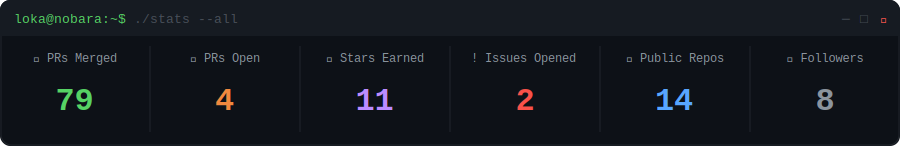
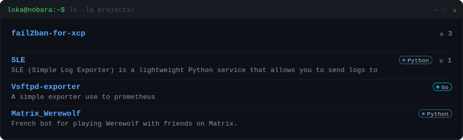
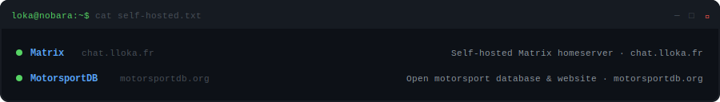

<!-- AUTO-GENERATED — do not edit manually -->
<!-- Last updated: 2026-07-05 · github.com/LucienLassalle/Dynamic-Readme -->

 

[GitHub @LucienLassalle](https://github.com/LucienLassalle) · [LinkedIn](https://www.linkedin.com/in/lucas-ravagnier/) · [Matrix `@loka:lloka.fr`](https://matrix.to/#/@loka:lloka.fr)

---

## `> cat about.json`

---

## `> ./stats --all`

> _0 public contributions · 0 issues opened / 0 closed_

---

## `> cat languages.txt`

---

## `> cat skills.json`

---

## `> gh pr list --author @me --state all`

0 PRs merged · 0 open in total

---

## `> ls -la projects/`

---

## `> cat self-hosted.txt`

---

## `> git log --all --oneline`

---

## `> cat codewars.md`

Auto-generated daily · 2026-07-05 · 0 followers · 0 following ·
<!-- <a href="https://github.com/LucienLassalle/Dynamic-Readme">How this works ↗</a> -->

