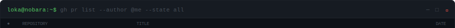
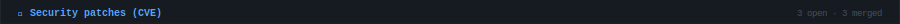
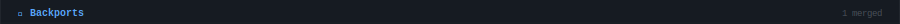
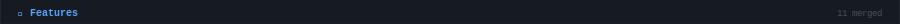
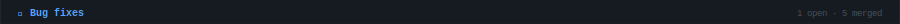
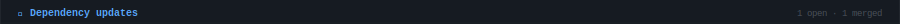
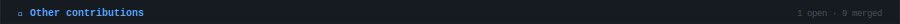
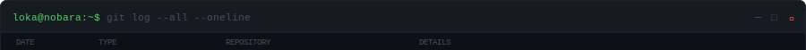

<!-- AUTO-GENERATED — do not edit manually -->
<!-- Last updated: 2026-06-30 · github.com/LucienLassalle/Dynamic-Readme -->

 

[GitHub @LucienLassalle](https://github.com/LucienLassalle) · [LinkedIn](https://www.linkedin.com/in/lucas-ravagnier/) · [Matrix `@loka:lloka.fr`](https://matrix.to/#/@loka:lloka.fr)

---

## `> cat about.json`

---

## `> ./stats --all`

> _208 public contributions · 2 issues opened / 1 closed_

---

## `> cat languages.txt`

---

## `> cat skills.json`

---

## `> gh pr list --author @me --state all`

<table cellpadding="0" cellspacing="0" border="0" width="100%">
<tr><td style="line-height:0;font-size:0;padding:0;margin:0"></td></tr>
<tr><td style="line-height:0;font-size:0;padding:0;margin:0"></td></tr>
<tr><td style="line-height:0;font-size:0;padding:0;margin:0"></td></tr>
<tr><td style="line-height:0;font-size:0;padding:0;margin:0"></td></tr>
<tr><td style="line-height:0;font-size:0;padding:0;margin:0"></td></tr>
<tr><td style="line-height:0;font-size:0;padding:0;margin:0"></td></tr>
<tr><td style="line-height:0;font-size:0;padding:0;margin:0"></td></tr>
<tr><td style="line-height:0;font-size:0;padding:0;margin:0"></td></tr>
<tr><td style="line-height:0;font-size:0;padding:0;margin:0"></td></tr>
<tr><td style="line-height:0;font-size:0;padding:0;margin:0"></td></tr>
<tr><td style="line-height:0;font-size:0;padding:0;margin:0"></td></tr>
<tr><td style="line-height:0;font-size:0;padding:0;margin:0"></td></tr>
<tr><td style="line-height:0;font-size:0;padding:0;margin:0"></td></tr>
<tr><td style="line-height:0;font-size:0;padding:0;margin:0"></td></tr>
<tr><td style="line-height:0;font-size:0;padding:0;margin:0"></td></tr>
<tr><td style="line-height:0;font-size:0;padding:0;margin:0"></td></tr>
<tr><td style="line-height:0;font-size:0;padding:0;margin:0"></td></tr>
<tr><td style="line-height:0;font-size:0;padding:0;margin:0"></td></tr>
<tr><td style="line-height:0;font-size:0;padding:0;margin:0"></td></tr>
<tr><td style="line-height:0;font-size:0;padding:0;margin:0"></td></tr>
<tr><td style="line-height:0;font-size:0;padding:0;margin:0"></td></tr>
<tr><td style="line-height:0;font-size:0;padding:0;margin:0"></td></tr>
<tr><td style="line-height:0;font-size:0;padding:0;margin:0"></td></tr>
<tr><td style="line-height:0;font-size:0;padding:0;margin:0"></td></tr>
<tr><td style="line-height:0;font-size:0;padding:0;margin:0"></td></tr>
<tr><td style="line-height:0;font-size:0;padding:0;margin:0"></td></tr>
<tr><td style="line-height:0;font-size:0;padding:0;margin:0"></td></tr>
<tr><td style="line-height:0;font-size:0;padding:0;margin:0"></td></tr>
<tr><td style="line-height:0;font-size:0;padding:0;margin:0"></td></tr>
<tr><td style="line-height:0;font-size:0;padding:0;margin:0"></td></tr>
<tr><td style="line-height:0;font-size:0;padding:0;margin:0"></td></tr>
<tr><td style="line-height:0;font-size:0;padding:0;margin:0"></td></tr>
<tr><td style="line-height:0;font-size:0;padding:0;margin:0"></td></tr>
<tr><td style="line-height:0;font-size:0;padding:0;margin:0"></td></tr>
<tr><td style="line-height:0;font-size:0;padding:0;margin:0"></td></tr>
<tr><td style="line-height:0;font-size:0;padding:0;margin:0"></td></tr>
<tr><td style="line-height:0;font-size:0;padding:0;margin:0"></td></tr>
<tr><td style="line-height:0;font-size:0;padding:0;margin:0"></td></tr>
<tr><td style="line-height:0;font-size:0;padding:0;margin:0"></td></tr>
<tr><td style="line-height:0;font-size:0;padding:0;margin:0"></td></tr>
<tr><td style="line-height:0;font-size:0;padding:0;margin:0"></td></tr>
<tr><td style="line-height:0;font-size:0;padding:0;margin:0"></td></tr>
<tr><td style="line-height:0;font-size:0;padding:0;margin:0"></td></tr>
</table>

74 PRs merged · 6 open in total

---

## `> ls -la projects/`

---

## `> cat self-hosted.txt`

---

## `> git log --all --oneline`

<table cellpadding="0" cellspacing="0" border="0" width="100%">
<tr><td style="line-height:0;font-size:0;padding:0;margin:0"></td></tr>
<tr><td style="line-height:0;font-size:0;padding:0;margin:0"></td></tr>
<tr><td style="line-height:0;font-size:0;padding:0;margin:0"></td></tr>
<tr><td style="line-height:0;font-size:0;padding:0;margin:0"></td></tr>
<tr><td style="line-height:0;font-size:0;padding:0;margin:0"></td></tr>
<tr><td style="line-height:0;font-size:0;padding:0;margin:0"></td></tr>
<tr><td style="line-height:0;font-size:0;padding:0;margin:0"></td></tr>
<tr><td style="line-height:0;font-size:0;padding:0;margin:0"></td></tr>
<tr><td style="line-height:0;font-size:0;padding:0;margin:0"></td></tr>
<tr><td style="line-height:0;font-size:0;padding:0;margin:0"></td></tr>
<tr><td style="line-height:0;font-size:0;padding:0;margin:0"></td></tr>
<tr><td style="line-height:0;font-size:0;padding:0;margin:0"></td></tr>
<tr><td style="line-height:0;font-size:0;padding:0;margin:0"></td></tr>
</table>

---

## `> cat codewars.md`

Auto-generated daily · 2026-06-30 · 7 followers · 4 following ·
<!-- <a href="https://github.com/LucienLassalle/Dynamic-Readme">How this works ↗</a> -->

